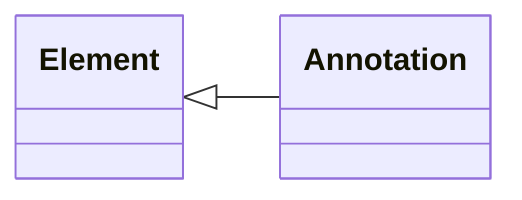

SPDX-License-Identifier: Community-Spec-1.0

# Annotation


## Summary
An `Annotation` refers to a note, comment, or explanation that is attached to an [Element](Element.md), in order to provide clarification, commentary, or additional information. Annotations can be created by the original author, editors, reviewers, or consumers of an SPDX document.

## Description
Annotations can be presented in different formats, including text, symbols, highlights, or graphical elements, depending on the context and the intended audience, and they may be included in the same or a different SPDX document than the subject of the annotation.

## Properties

=== "Annotation"

    | Name             | Type                                                  | Cardinality                 |
    | ---------------- | ----------------------------------------------------- | --------------------------- |
    | `annotationType` | [`AnnotationType`](../Vocabularies/AnnotationType.md) | `1..1`{ title="Required." } |
    | `contentType`    | `MediaType`                                           | `0..1`{ title="Optional." } |
    | `statement`      | `String`                                              | `1..1`{ title="Required." } |
    | `subject`        | [`ElementRef`](Element.md)                            | `1..1`{ title="Required." } |
  
=== "Element (inherited)"

  -8<-- "docs/reference/Core/Classes/Element_Properties.mdi"

## Syntax

=== "JSON"

    ```json
    {
      "@id": "[URI]",
      "@type": "Annotation",
      "creationInfo": {
        "specVersion": "3.0",
        "profile": [{"id": "core"}],
        "created": "[DateTime]",
        "createdBy": ["[ElementRef]"]
      },
      "subject": "[ElementRef]",
      "annotationType": "[AnnotationType]",
      "contentType": "[MediaType]",
      "statement": "[String]"
    }
    ```

=== "YAML"

    ```yaml
    @id: ...
    @type: Annotation
    creationInfo:
      specVersion: "3.0"
      profile:
        - id: core
      created: ...
      createdBy:
        - ...
    subject: ...
    annotationType: ...
    contentType: ...
    statement: ...
    ```

=== "RDF"

    ```xml
    <Annotation>
      <annotationType rdf:resource="http://spdx.org/rdf/terms#annotationType_other" />
    </Annotation>
    ```

=== "Tag/Value"

    ```text
    AnnotationType: REVIEW
    AnnotationSubject: 
    AnnotationType: 
    AnnotationStatement: 
    ```


## Examples

